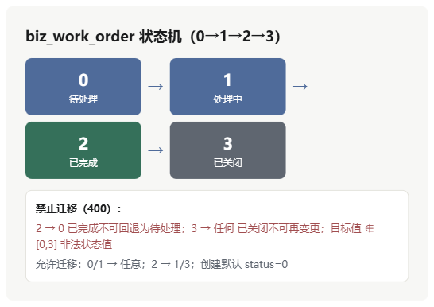
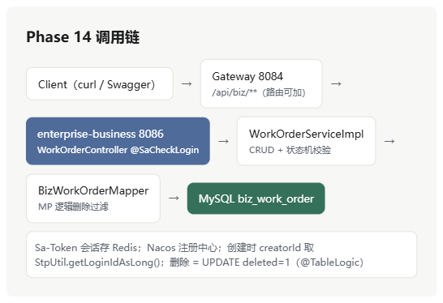

# Phase 14：enterprise\-business 业务工单模块 · 完整阶段文档

# Phase 14：enterprise\-business 业务工单模块・完整阶段文档

## 一、本阶段目标

| 项       | 说明                                                                                                  |
|----------|-------------------------------------------------------------------------------------------------------|
| 业务示例 | 核心业务服务落地：**工单 CRUD \+ 状态流转**                                                           |
| 规范对齐 | 依赖收口、配置（Nacos/MP/Sa\-Token/springdoc）、建表、异常处理与既有模块（auth/user/system/file）一致 |
| 验收标准 | 全链路 CRUD 通过、状态机合法 / 非法路径判定正确、鉴权生效、逻辑删除生效                               |

## 二、实现内容

### 1\. 模块结构（10 个类）

```Plain Text
enterprise-business/src/main/java/com/example/enterprise/business/
├── EnterpriseBusinessApplication.java    # 启动类
├── controller/WorkOrderController.java   # HTTP 入口（6 端点，类级 @SaCheckLogin）
├── service/WorkOrderService.java         # 业务接口
├── service/impl/WorkOrderServiceImpl.java# CRUD + 状态流转校验
├── entity/BizWorkOrder.java              # 实体（extends BaseEntity）
├── mapper/BizWorkOrderMapper.java        # MyBatis-Plus Mapper
├── vo/WorkOrderVO.java                   # 对外视图
├── dto/WorkOrderCreateDTO.java           # 创建参数（@NotBlank/@Size 校验）
├── dto/WorkOrderUpdateDTO.java           # 更新参数
├── dto/WorkOrderQueryDTO.java            # 分页查询（extends PageQuery）
├── dto/WorkOrderStatusDTO.java           # 状态变更参数
└── config/{SaTokenConfig, BusinessExceptionHandler}.java
```

### 2\. 核心接口（`/api/biz/work-orders`）

| 方法   | 路径                               | 说明                                                                    |
|--------|------------------------------------|-------------------------------------------------------------------------|
| GET    | `/api/biz/work-orders`             | 分页（title 模糊 /status/priority 过滤，id 倒序）                       |
| GET    | `/api/biz/work-orders/{id}`        | 详情                                                                    |
| POST   | `/api/biz/work-orders`             | 创建（title 必填、content≤1024、priority 默认 2、creatorId 取登录用户） |
| PUT    | `/api/biz/work-orders/{id}`        | 更新（**已完成 / 已关闭禁止修改**）                                     |
| PUT    | `/api/biz/work-orders/{id}/status` | 状态流转（含规则校验）                                                  |
| DELETE | `/api/biz/work-orders/{id}`        | 逻辑删除                                                                |

### 3\. 状态机设计（核心）

**状态定义**：`0 待处理 → 1 处理中 → 2 已完成 → 3 已关闭`

**流转规则**（`changeStatus` 实现）：

- 目标值越界（`<0 或 >3`）→ 400「非法状态值」

- `当前 == 已关闭(3)` → 任何目标都拒绝（400「已关闭工单不可再变更状态」）

- `当前 == 已完成(2) 且 目标 == 待处理(0)` → 拒绝（400「已完成不可回退为待处理」）

- 其余路径放行

**合法 / 非法矩阵**（已实测验证 ✅）：

| 当前 \\ 目标 | 0 待处理    | 1 处理中 | 2 已完成 | 3 已关闭 |
|--------------|-------------|----------|----------|----------|
| 0 待处理     | —           | ✅       | ✅       | ✅       |
| 1 处理中     | ✅          | —        | ✅       | ✅       |
| 2 已完成     | ❌ 禁止回退 | ✅       | —        | ✅       |
| 3 已关闭     | ❌          | ❌       | ❌       | ❌       |

### 4\. 业务规则细节

- **工单号**：`WO + yyyyMMddHHmmss + 4 位随机`（`uk_order_no` 唯一约束），实测 `WO202610061946294720`

- **默认值**：创建时 `status=0`、`priority=2`（dto 为 null 时）

- **审计字段**：`creatorId` 取 Sa\-Token 登录用户 ID；`created_at/updated_at/created_by/updated_by/deleted` 由 BaseEntity \+ common MetaObjectHandler 自动填充

- **更新规则**：已完成 / 已关闭工单内容不可修改；title/priority/assigneeId/remark 支持部分更新（null 不覆盖）

### 5\. 数据库设计（`docs/sql/04_business.sql`）

表 `biz_work_order`（16 列 = 11 业务 \+ 5 BaseEntity，含 `uk_order_no` 唯一索引 \+ status/creator\_id/assignee\_id/created\_at 普通索引）：

| 字段                       | 类型                    | 说明                                       |
|----------------------------|-------------------------|--------------------------------------------|
| id                         | BIGINT PK AUTO          | 主键                                       |
| order\_no                  | VARCHAR\(32\) UNIQUE    | 工单编号                                   |
| title                      | VARCHAR\(128\) NOT NULL | 标题                                       |
| content                    | VARCHAR\(1024\)         | 内容描述                                   |
| priority                   | TINYINT DEFAULT 2       | 1 高 2 中 3 低                             |
| status                     | TINYINT DEFAULT 0       | 0 待处理 1 处理中 2 已完成 3 已关闭        |
| assignee\_id / creator\_id | BIGINT                  | 处理人 / 创建人                            |
| remark                     | VARCHAR\(256\)          | 备注                                       |
| created\_at / updated\_at  | DATETIME                | 审计（ON UPDATE 自动维护）                 |
| created\_by / updated\_by  | BIGINT                  | 审计（⚠ 曾缺列导致 Unknown column，已补） |
| deleted                    | TINYINT DEFAULT 0       | 逻辑删除（@TableLogic）                    |

### 6\. 配置（application\.yml）

- **端口 8086**（避开 auth 8081 /user 8082 /system 8083 /gateway 8084 /file 8085）

- Nacos 注册 `enterprise-business`（fail\-fast=false，config 默认关闭）

- MyBatis\-Plus：逻辑删除 `deleted` 字段、`map-underscore-to-camel-case`、`log-impl` SQL 日志

- Sa\-Token：`Authorization` 头 \+ `Bearer` 前缀、timeout 7200、uuid 风格

- springdoc：`/swagger-ui.html`

- 依赖：common/web/validation/redis/mp/mysql/sa\-token×2/nacos×2/bootstrap/springdoc/actuator/test（版本全部根 pom 收口）

## 三、配置与启动

```powershell
cd D:\桌面文件\Java.learn\code\full-stack\enterprise

# ① 安装依赖链
mvn "-Dmaven.repo.local=D:\HJYT\tools\libs" -pl enterprise-common,enterprise-business -am install "-DskipTests"

# ② 启动（前提：Nacos/Redis/MySQL 可用，auth 8081 运行中用于取 token）
mvn "-Dmaven.repo.local=D:\HJYT\tools\libs" -pl enterprise-business spring-boot:run
```

## 四、验证方案与验收结果（全绿）

**链路**：登录 \(auth 8081 取 token\) → 创建 → 详情 → 分页 → 更新 → 状态流转（0→1→2）→ 非法回退 \(400\) → 更新已关闭 \(400\) → 删除 → 再查 404

| 验证点             | 预期                                | 实测                            |
|--------------------|-------------------------------------|---------------------------------|
| 登录               | 200 \+ token                        | ✅ code=200                     |
| 创建               | 200 \+ id \+ orderNo                | ✅ id=2, `WO202610061946294720` |
| 详情               | status=0、creatorId=1               | ✅                              |
| 分页（title=Test） | total=1                             | ✅                              |
| 更新               | 200                                 | ✅                              |
| 状态 0→1→2         | 全 200                              | ✅                              |
| 2→0 回退           | 400「已完成不可回退为待处理」       | ✅                              |
| 更新已完成工单     | 400「已完成或已关闭的工单不可修改」 | ✅                              |
| 删除 / 删除后查询  | 200 / 404                           | ✅                              |

**异常约定**：业务异常统一 **HTTP 200 \+ body\.code 业务码**（common GlobalExceptionHandler `Result.fail`），仅未处理异常返回 HTTP 500。

## 五、遗留事项

1. 状态机的**显式 DSL / 配置化**（当前 if\-else 硬编码；可演进为状态机表 / 状态机框架）—— 记录为可选优化

2. 工单**分配 / 认领权限**（当前 assigneeId 任意填写，未校验角色）

3. 操作日志（Phase 12 预留的 `OperationLogMessage` 可在此落地）

4. 网关路由 `/api/biz/**` → `lb://enterprise-business`（当前直连 8086 验证）

## 六、历史阶段汇总（更新至 Phase 14）

| 阶段         | 结果                                                       |
|--------------|------------------------------------------------------------|
| Phase 0–1    | 版本矩阵 \+ 父工程 / 模块骨架                              |
| Phase 2      | common（Result / 异常 / Redis / MP）                       |
| Phase 3–4    | MySQL 全表 \+ 种子数据 / Redis 规范与工具                  |
| Phase 5–7    | Auth 8081 / User 8082 / System 8083                        |
| Phase 8–9    | Nacos / Gateway 8084                                       |
| Phase 10     | OpenFeign：Auth → User 内部调用                            |
| Phase 11     | Sentinel 限流（网关 \+ Auth）                              |
| Phase 12     | RocketMQ 异步登录日志链路（已提交 c8f8493）                |
| Phase 13     | enterprise\-file 文件服务 \+ 孤儿文件修复（待提交）        |
| **Phase 14** | **enterprise\-business 工单 CRUD \+ 状态流转（验收通过）** |

---

**附图 1：状态机流转图**



**附图 2：调用链架构图**



---
